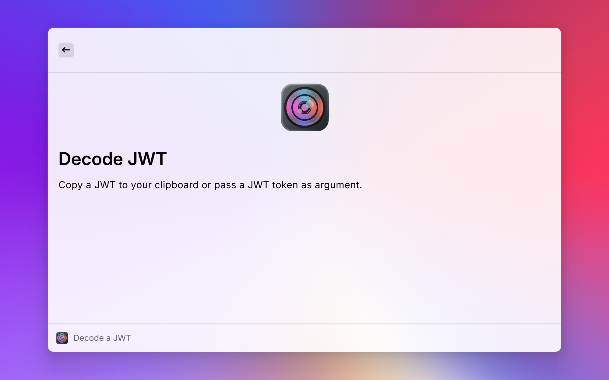
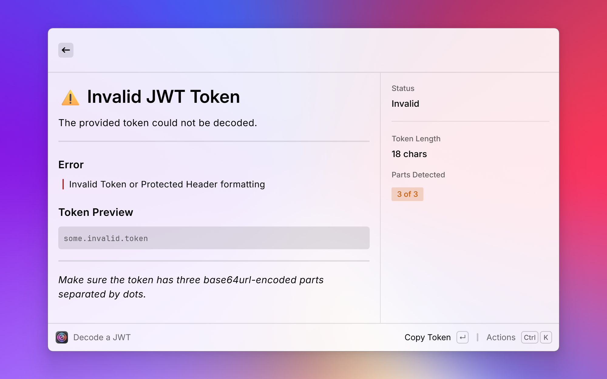
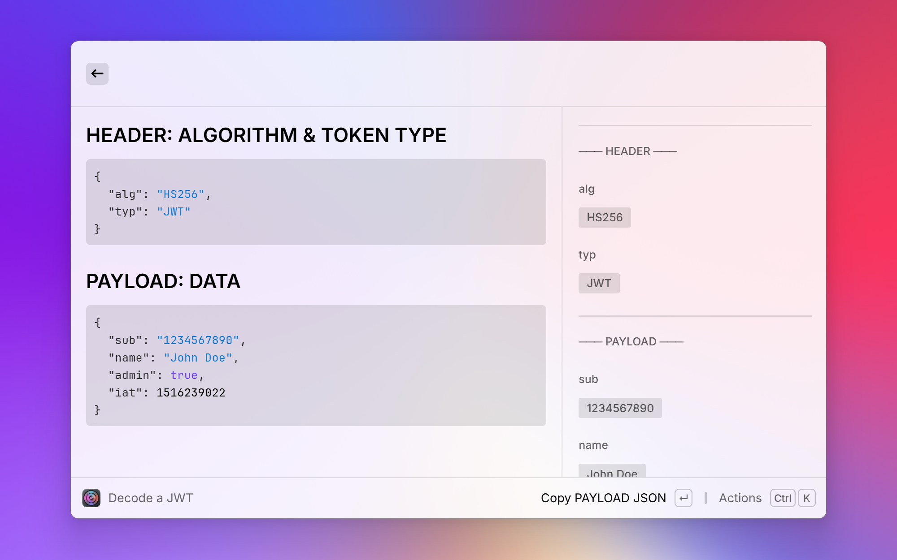

<div align="center">


# JWT Lens

</div>

Decode and inspect JSON Web Tokens directly in Raycast — no browser, no external tools needed.

## Features

- Paste a JWT and instantly see the decoded **Header** and **Payload**
- Displays all claims with human-readable labels (e.g. `exp` → Expiration Time)
- Shows the token status at a glance: valid, expired or not valid yet, with relative times and the token lifetime
- Verify the signature with a shared secret, a PEM public key, an X.509 certificate, a JWK / JWKS or a JWKS / OpenID discovery URL
- Splits scopes and array claims into separate tags and warns about unsigned tokens (`alg: none`)
- Copy the token, its signature, single claims or timestamps as ISO dates
- Your tokens never leave your machine — only public key sets are fetched when you verify against a URL

## Installation

JWT Lens is not published in the Raycast Store, so you install it from source. You need [Raycast](https://www.raycast.com), [Git](https://git-scm.com) and [Node.js](https://nodejs.org) 22 or newer.

1. Clone the repository:

   ```bash
   git clone https://github.com/DaBorsten/jwt-lens.git
   cd jwt-lens
   ```

2. Install the dependencies:

   ```bash
   npm install
   ```

3. Build the extension and add it to Raycast:

   ```bash
   npm run dev
   ```

   Raycast opens with **Decode a JWT** available. Stop the command with `Ctrl+C` once it has started. The extension stays installed.

To update, run `git pull`, then repeat steps 2 and 3.

## Usage

1. Open Raycast and run **Decode a JWT**
2. Paste your token into the argument field, or copy it to your clipboard before running the command
3. Browse the decoded claims in the detail view
4. Open the action panel to copy values or run **Verify Signature**

## Screenshots




